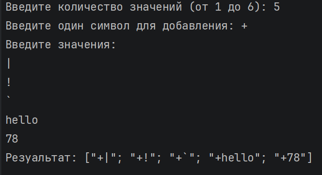
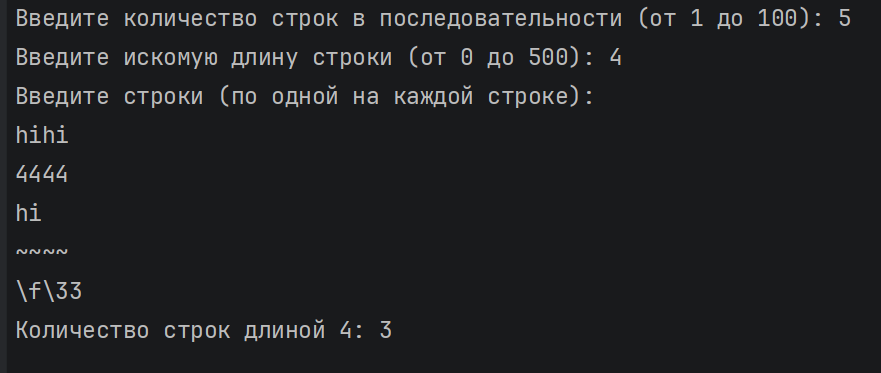
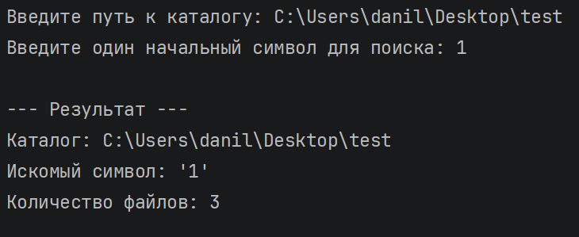
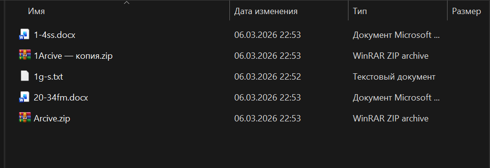

# Задание 1. Seq.map

## Задача 8

### Текст задачи

Решить задачу из лабораторной работы №2 (Задание 1. List.map) для
последовательности

### Алгоритм решения

1. Входные данные:

count (целое число) — количество строк, которые пользователь планирует ввести.

prefix (строка/символ) — один символ, который будет добавлен в начало каждой строки.

originalStrings — последовательность строк

2. Выходные данные:

resultStrings (последовательность строк) — новая последовательность, элементы которой будут сформированы в момент обращения к ним.

3. Логика работы:

Ввод количества элементов (readCount): Программа запрашивает число count.

Используется Int32.TryParse для безопасной обработки типа.

Проверка диапазона: Реализована рекурсивная проверка. Если число не входит в границы, функция вызывает саму себя до получения корректного ввода.

Ввод префикса (readPrefix): Программа запрашивает один символ.

Проверка корректности: Строка проверяется на отсутствие пустоты (String.IsNullOrEmpty) и строгое соответствие длине 1. Это гарантирует, что будет добавлен именно один символ.

Считывание последовательности (readStrings): Используется генератор последовательности.

цикл выполняется от 1 до count с указанием шага: 1 .. 1 .. count.

на каждой итерации возвращается результат ввода с Console.ReadLine().

Особенность: Ввод строк в консоли начнется только тогда, когда данные потребуются для вывода (материализации).

Трансформация последовательности (prependCharToAll): Используется функция Seq.map и оператор конвейера |>.

Функция не создает новый список в памяти немедленно. Она создает план трансформации. При обращении к каждому элементу последовательности к нему будет применяться интерполяция строк: {prefix}{item}.

4. Завершение и вывод: Для корректного отображения вычислений результирующая последовательность преобразуется в список с помощью Seq.toList.

Итоговый результат выводится на экран в удобном для чтения формате %A.

### Тестирование

# Задание 2. Seq.fold

## Задача 8

### Текст задачи

Решить задачу из лабораторной работы №2 (Задание 2. List.fold) для
последовательности

### Алгоритм решения

1. Входные данные:

count (целое число) — количество строк для ввода.

targetLen (целое число) — искомая длина строки.

stringsSeq (последовательность строк) — элементы вводимые пользователем.

2. Выходные данные:

resultCount (целое число) — количество строк

3. Логика работы:

Проверка параметров (readInt):

С помощью рекурсивной функции запрашиваются count и targetLen.

Проверка осуществляется через Int32.TryParse и сопоставление с образцом (match ... when), что гарантирует попадание чисел в заданный диапазон.

Формирование последовательности (readStrings):

Создается объект seq через генератор.

В отличие от списков, строки не считываются в память сразу. Каждая команда Console.ReadLine() сработает только тогда, когда функция свертки запросит следующий элемент.

Свертка последовательности (Seq.fold):

Применяется функция Seq.fold, которая сворачивает последовательность в одно единственное число.

Начальное значение: 0.

Механизм: Для каждого элемента str из stringsSeq проверяется условие str.Length = targetLength.

Если условие истинно, значение увеличивается на 1.

Если не истинно — передается на следующую итерацию без изменений.

Использование fold позволяет избежать создания промежуточных отфильтрованных коллекций, что экономит память.

5. Вывод результата:

После обработки последнего элемента последовательности итоговое значение аккумулятора выводится на экран.

### Тестирование

# Задание 3. Решить с использованием последовательности задачу на обработку файлов/каталогов

## Задача 8

### Текст задачи

Вывести количество файлов, имя которых начинается с заданного
символа, в указанном каталоге (без подкаталогов).

### Алгоритм решения

1. Входные данные:

directoryPath (строка) — путь к папке на диске.

targetChar (символ) — символ, по которому будет производиться фильтрация файлов.

2. Выходные данные:

resultCount (целое число) — количество найденных файлов.

3. Логика работы:

Ввод и валидация пути (readDirectoryPath):

Программа запрашивает строку пути.

Выполняется проверка на пустоту (IsNullOrWhiteSpace).

Используется метод Directory.Exists для подтверждения наличия папки в файловой системе. При ошибке применяется рекурсивный вызов.

Ввод символа (readTargetCharacter):

Программа проверяет, что введена строка строго длиной 1 символ.

Обработка данных (countFilesStartingWith):

Извлечение данных: Метод Directory.GetFiles(directoryPath) возвращает массив полных путей ко всем файлам.

Трансформация (Array.map): С помощью Path.GetFileName из каждого полного пути извлекается только имя файла.

Фильтрация (Array.filter): К каждому имени применяется предикат (условие). Проверяется равенство первого символа строки fileName.[0] и искомого символа targetChar.

Подсчет: Функция Array.length возвращает финальное количество элементов, прошедших фильтрацию.

Обработка исключений (try with):

Используется фильтр типов :? UnauthorizedAccessException для обработки ситуаций, когда у программы нет прав доступа к указанной папке.

Используется перехват error для проверки прочих системных ошибок через свойство error.Message.

Завершение:

Результат выводится в консоль с указанием проверенного пути и выбранного символа.

### Тестирование

